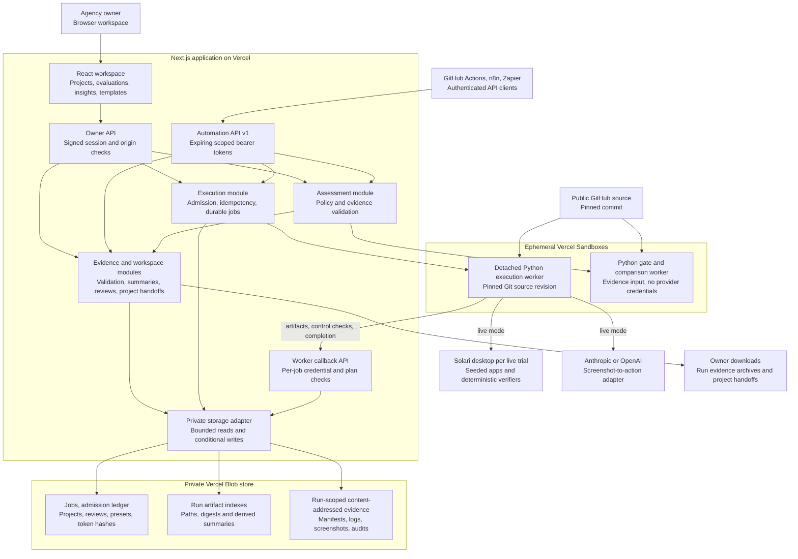
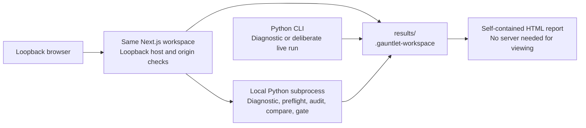

# Solaris architecture

Solaris helps agencies evaluate computer-use automations, investigate their failures and package evidence for a client handoff. The Next.js workspace manages evaluations and delivery records; the Python Gauntlet harness executes the tasks and determines outcomes from machine state. A successful HTTP request, completed worker or manually marked delivery status is not a passing evaluation.

This document describes the implemented system. [Request and response diagrams](QUERY_RESPONSE.md) trace its API operations. [Deployment](VERCEL.md), [integrations](INTEGRATIONS.md) and [evidence bundles](EVIDENCE_BUNDLES.md) cover operation and setup.

## Overall cloud architecture

The two sandbox roles are separate. An **execution worker** runs the evaluation and uploads evidence while the owner polls its durable job. An **assessment worker** receives already saved evidence, runs the authoritative Python comparison or gate and returns a bounded JSON result during the HTTP request. Assessment does not start desktops or call models. Both run application code from a pinned Git commit; uploaded evidence is treated as data.

The hosted UI uses Next.js, TypeScript, Tailwind v4, shadcn/ui, Lucide and Motion. GitHub Actions calls the versioned API through the checked-in Node client. n8n and Zapier use authenticated HTTP actions; Solaris does not host their workflows or store their account credentials. The shared owner workspace is a single security boundary: client projects and delivery statuses organize work but do not create client accounts or enforce tenant isolation.

## Evaluation and verification boundary

```mermaid
flowchart LR
    Task["Validated YAML task<br/>Plan, limits and source fingerprints"] --> Preflight["Preflight before allocation"]
    Preflight --> Desktop["Fresh desktop or diagnostic fixture"]
    Desktop --> Baseline["Seed fixtures and preserve baseline"]
    Baseline --> Screen["Capture screenshot"]
    Screen --> Agent["Provider adapter<br/>or static diagnostic agent"]
    Agent --> Action["Validate and execute GUI action"]
    Action -->|"Continue within limits"| Screen
    Action -->|"Stop, timeout or failure"| Verify["Inspect files, clipboard and submissions<br/>Deterministic state verifier"]
    Verify --> Cleanup["Bounded cleanup in finalization<br/>Lifecycle evidence"]
    Cleanup --> Evidence["Atomic results and trial evidence<br/>Costs, errors, coverage and reports"]
```

The model chooses GUI actions; it does not choose the verdict. The harness preserves task definitions and protected-file baseline hashes, then checks resulting files, clipboard contents and fixture application submissions. Each trial has separate preparation, action, verification and cleanup limits. Infrastructure and cleanup failures remain separate from ordinary task failures. The infrastructure failure threshold stops queued trials while active trials finish finalization.

Diagnostic mode uses local temporary fixtures and a static agent. It exercises orchestration, persistence, verification and reporting without Solari or model calls. Its expected task failures are labelled `dry-run`; diagnostic gates cannot establish live automation quality. Live mode passes only the selected provider's credential and the Solari credential to the execution process. Live provider performance and remote desktop cleanup remain unverified until a live acceptance run is performed.

Sources: [runner](../gauntlet/harness/runner.py), [desktop backends](../gauntlet/harness/backends.py), [verifiers](../gauntlet/verifiers/state.py), [provider adapters](../gauntlet/agent/), [assessment rules](../gauntlet/harness/assessment.py).

## Storage layout and ownership

| Durable location | Contents and authority | Update model |
| --- | --- | --- |
| `jobs/<cloud_id>.json` | Execution plan, source revision, job state, provider worker identifiers and private callback credential | Conditional JSON updates; public responses omit callback credentials and request fingerprints |
| `control/job-admission.json` | Active or uncertain execution reservations | Compare-and-swap across application instances before worker allocation |
| `indexes/<run_id>.json` | Allowed evidence paths mapped to immutable object keys, sizes and SHA-256 hashes; optional versioned run-card summary tied to the manifest digest | Compare-and-swap when artifacts arrive; changed manifests and summaries publish together |
| `artifacts/<run_id>/<sha256>` | Original evidence bytes; identical content shares a key within that run | Create-if-absent; readers verify size and digest |
| `workspace/metadata.json` | Versioned review histories, saved setups and attempt links, encoded as named JSON documents | Existing local validation rules plus conditional cloud commit |
| `workspace/client-projects.json` | Names, clients, run references, manual delivery status and notes | Per-project revision check plus conditional document commit |
| `workspace/integration-tokens.json` | Token hashes, names, prefixes, scopes, expiry and revocation records | Conditional document updates; raw tokens returned only at creation |

The artifact index is the pointer to readable evidence. Writing object bytes and publishing an index entry are separate operations: a failed index commit can leave an unreferenced object, but it cannot publish an incomplete upload. Existing revisions are preserved. There is no automatic garbage collection or destructive retention process. Complete backup must include the private objects, indexes, jobs and workspace metadata; a per-run export is a handoff archive, not a workspace restore format.

Metadata and artifact access pass through the storage adapter. It validates paths, bounds payloads, rejects malformed JSON and uses the ETag from the same response as the bytes for conditional writes. Missing data and corrupt data are distinct; corrupt saved metadata is never silently replaced with an empty document. Private JSON API responses use `Cache-Control: no-store`.

Sources: [storage](../web/lib/cloud-storage.ts), [artifact module](../web/lib/cloud-artifacts.ts), [workspace adapter](../web/lib/cloud-workspace-data.ts), [projects](../web/lib/client-projects.ts), [integration credentials](../web/lib/integration-tokens.ts).

## Storage and query efficiency

These optimizations reduce redundant work without deleting preserved evidence or caching authorization decisions.

| Path | Implemented optimization and operation count | Correctness boundary |
| --- | --- | --- |
| Cloud run library | Default request scans one page of up to 50 indexes, replacing the fixed 200-index scan; summary-backed per-run reads fall from one index plus one manifest to one index and zero manifest reads | Summary is tied to the current manifest digest; absent, old or invalid summaries fall back to verified manifest bytes |
| Run detail | Parse verified manifest bytes directly in memory | Full manifest validation remains; no temporary filesystem round trip |
| Trial detail | One index snapshot supplies manifest, actions and screenshot membership, replacing three index reads | All referenced object bytes still pass size and SHA-256 checks |
| Duplicate artifact callback | A matching path, object key, size and digest returns after one index read | No object upload or index rewrite; this is deduplication, not a new integrity audit of the stored body |
| Concurrent reads of the same immutable object | Same key and size limit share an in-flight read within one server instance; each caller receives its own buffer | Up to 64 tracked reads; success or error removes the entry; no retained cache or TTL |
| Library refresh and paging | UI aborts superseded requests, ignores late responses and merges pages by run ID | Refresh resets the first page; failed loading retains existing results |
| Job polling | Read current admission reservations independently of paged history; known active jobs that leave the ledger are refreshed by ID | Confirmed-idle polling every 60 seconds; active/uncertain tracking every 10 seconds; hidden tabs pause status polling; no capacity inference from a partial archive |
| Project handoff | Resolve all assigned IDs directly; capture a verified manifest using two index reads and one manifest read per available evaluation | Project revision checked before and after collection; unavailable runs remain explicit; no full artifact downloads or storage writes |

The summary is optional metadata inside the existing version-1 artifact index: `runSummary: { version: 1, manifestSha256, run }`. Ingestion derives it from a parsed manifest and commits it with that manifest's pointer. Old runs need no migration to remain readable, and list requests do not rewrite their indexes. A summary lets a list page avoid re-reading the complete body; it is not a fresh integrity audit. Detail, export and assessment reads verify the evidence they consume.

The counts above describe module operations, excluding authentication reads, provider-page listing and other request-specific work. They are not measured wall-clock latency or storage-byte savings. Evidence content remains unchanged: there is no new compression, cross-run deduplication or garbage collection. Older deployments used strict schemas without index `runSummary` and project delivery fields; rollback must use readers compatible with those fields. Do not delete or strip evidence to force an older deployment to read new indexes.

`GET /api/runs` and `GET /api/automation/v1/runs` expose cloud pages with `limit` (1–200; default 50) and an opaque `cursor`. Their response includes `page.nextCursor`, `page.limit` and `page.scanned`. Pages follow provider listing order; only the loaded records are sorted by creation time. They are not a globally newest-first query or a snapshot transaction. Search, project assignment choices and insights explicitly operate on the loaded set. [The paging contract](QUERY_RESPONSE.md#paged-library-queries) describes continuation and refresh behavior.

Mutable JSON reads remain fresh: owner/API credential checks, token revocation, admission state, artifact indexes and project revisions never use the immutable-body coalescer. There is no SQL database, search index, distributed response cache or background compaction job. Job history also supports continuation pages; admission initialization retains its separate bounded legacy scan. The reservation read view validates the existing ledger without initializing it, allocating workers, pruning reservations or querying provider inventory. Job expiry reads can still persist the existing interrupted-state reconciliation.

The [project handoff](PROJECT_HANDOFF_EXPORTS.md) is a metadata-only Markdown/JSON download: private notes and raw evidence are omitted, live/diagnostic modes stay distinct, and incomplete cost or coverage remains explicit. Per-run evidence archives remain the way to download actual artifacts. Neither export provides client authentication or full workspace restore.

Sources: [summary projection](../web/lib/cloud-run-summary.ts), [query validation](../web/lib/library-query.ts), [artifact module](../web/lib/cloud-artifacts.ts), [storage adapter](../web/lib/cloud-storage.ts), [workspace loading](../web/components/workspace.tsx), [job polling](../web/components/cloud-jobs.tsx).

## Local operation

`GAUNTLET_STORAGE=vercel` selects cloud behavior explicitly. Without it, the workspace uses local `results/` and `.gauntlet-workspace/` files and accepts only loopback requests. This is a supported operating mode, not an automatic failover destination for cloud outages. A storage outage returns an error; the app does not silently switch stores or lose the identity of a run. Local browsing remains available if Python is unavailable, and preserved evidence can still be inspected with the CLI when an assessment API fails.

Local web launch is diagnostic-only; live execution is an explicit CLI command. Cloud-only features include persistent detached jobs, client projects, scoped automation keys and owner sign-in. Local file readers reject path traversal, symlinks, special files and oversize artifacts. Local metadata commits use filesystem ownership and revision checks; cloud metadata uses Blob conditional writes while reusing those domain rules.

Sources: [request guard](../web/lib/http.ts), [local evidence store](../web/lib/store.ts), [local workspace data](../web/lib/workspace-data.ts), [Python invocation](../web/lib/harness.ts), [offline report](../gauntlet/html_report.py).

## Failure behavior and operating limits

| Condition | Implemented behavior |
| --- | --- |
| Repeated launch after a lost response | Stable idempotency key returns the same durable job; changed setup with that key returns 409 |
| Concurrent launches | Atomic admission enforces the evaluation-job cap; capacity rejection returns 429 before creating a job |
| Ambiguous worker launch or stop | No automatic paid replay; job remains inspectable and uncertain capacity is retained until safely reconciled |
| Interrupted or cancelled evaluation | Keep partial evidence and original plan; cancellation acknowledgment does not prove deletion of external desktops |
| Conflicting metadata edit | Return 409; preserve the saved record and the user's draft for review |
| Missing action log or screenshot | Keep available trial results, expose a warning or missing-artifact error |
| Invalid evidence, gate input or worker output | Reject assessment rather than infer a passing result |
| Active, changing, corrupt or oversize export | Reject the whole archive; do not silently omit files |

Hosted setup allows 12 shipped tasks, 1–3 trials per task and concurrency 1–2 within each evaluation. Workspace admission defaults to two evaluations and can be configured from one to eight. This cap excludes assessment workers and is not a spending cap. Execution workers have a 45-minute lifetime; assessment workers use a 180-second request deadline and a 210-second provider lifetime. Limits bound work but do not establish cleanup of a live Solari desktop.

Worker uploads allow 2 MiB per artifact and the artifact index allows 5,000 entries. Assessment material is bounded to 128 MiB; its output is bounded to 2 MiB. Evidence bundles allow 64 MiB of captured evidence and annotations, with up to 5,000 evidence files. Client metadata allows 100 projects and 200 evaluation references per project. These are explicit product limits, not claims of unlimited archive scalability.

Custom workflow authoring, tenant identity/permissions, billing, complete backup/restore, automatic retention and live provider acceptance remain separate work. See [product readiness](PRODUCT_READINESS.md) for remaining scope.

## Verified release

The architecture/storage release `46a0344` passed 621 automated tests, the production build, both HTTP integration checks and real cloud acceptance. The production archive traversed five pages with older and newly written indexes; the new summary returned a run card using one index read and zero manifest reads. Project notes, legacy updates, conflicts and reversible archive were checked against private production storage. These are diagnostic and storage checks, not live model benchmarks. [Deployment acceptance](VERCEL.md#verification-and-production-acceptance) records the exact scope and run identity.
