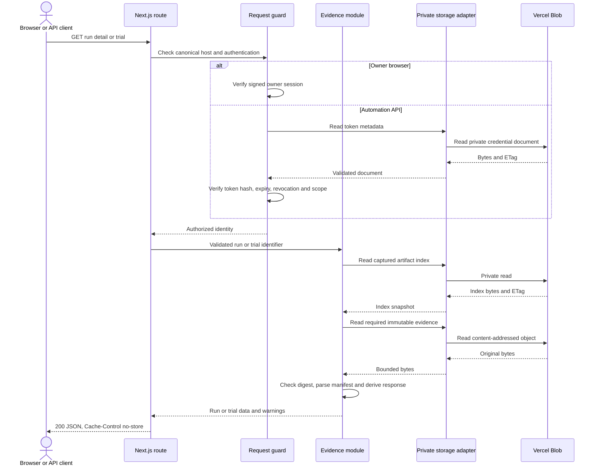
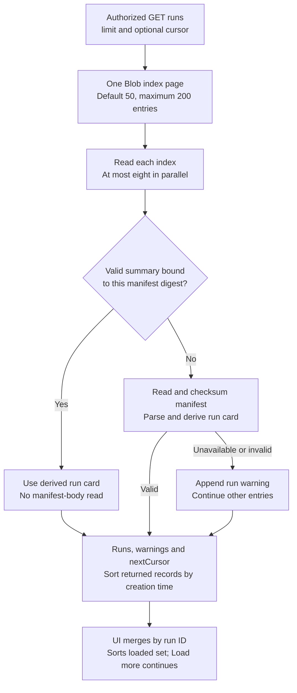
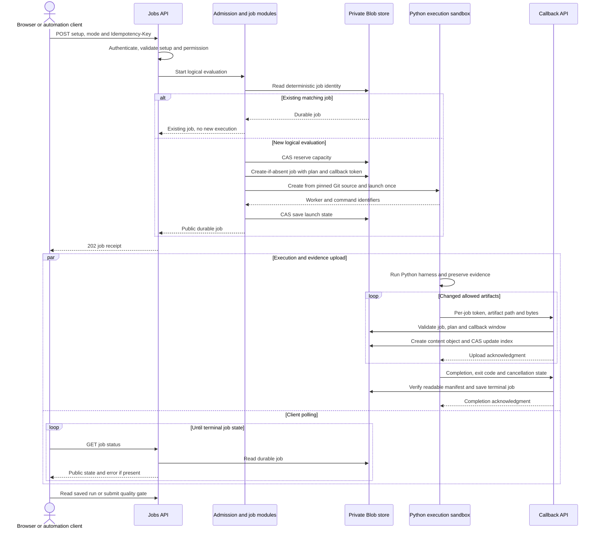
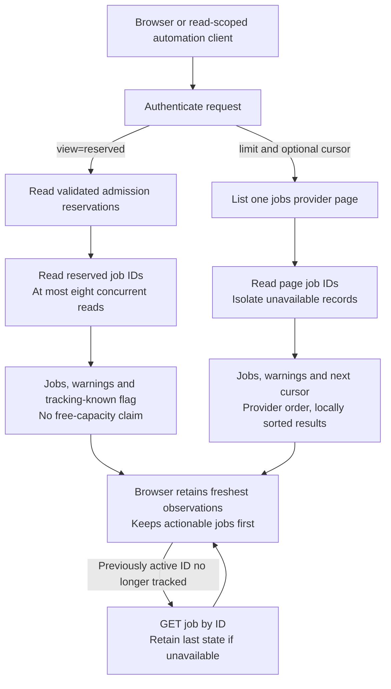
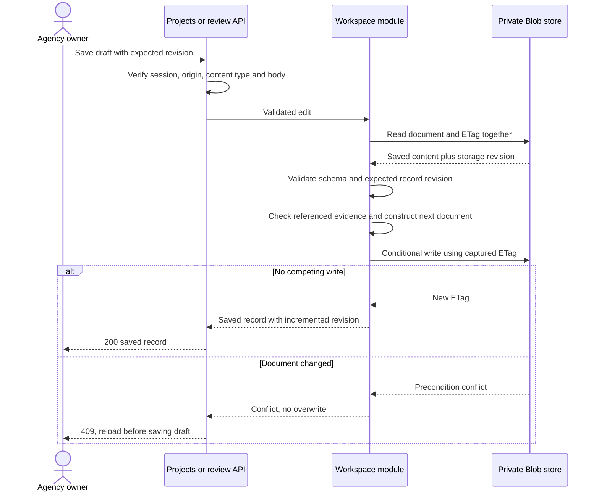
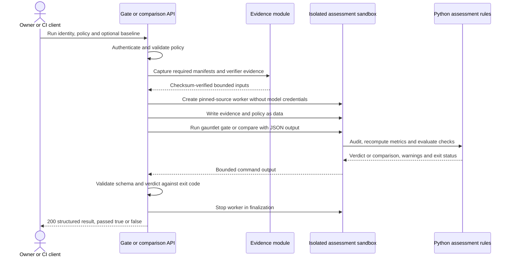
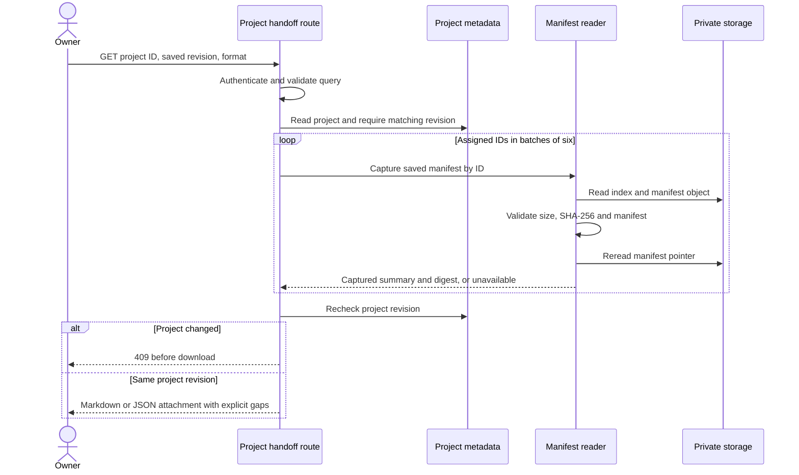

# Query and response architecture

Solaris queries are authenticated HTTP reads and writes against saved evaluation evidence and workspace metadata. Model requests occur inside evaluation workers during live trials; the workspace does not implement a retrieval-augmented chat or natural-language database layer. These diagrams describe the shipped REST request/response paths and their failure contracts.

The [overall architecture](ARCHITECTURE.md) shows deployment boundaries. [Integration setup](INTEGRATIONS.md) lists machine API paths and credential scopes.

## Authentication and saved-evidence reads



Owner sessions are 12-hour signed, `HttpOnly`, secure, same-site cookies created by `/api/session`. Owner writes also require the configured origin and JSON content type. Machine routes use a separate bearer token and verify its scope on each request; an owner cookie is not an automation credential. Invalid credentials return 401, disallowed origin or scope returns 403, and authorization completes before evidence reads.

Run detail parses checksum-verified manifest bytes directly in memory and validates task/trial identities. Trial detail captures one index and uses it for the manifest, action frames and available screenshot names. This prevents an index revision from being mixed in halfway through the same trial response. Screenshots are fetched separately through the authenticated artifact route. A missing or unreadable action log produces a warning while preserving the saved trial result. A failed checksum never produces a valid artifact response. Local requests use the same domain parsing after loopback and safe-file checks.

Sources: [owner auth](../web/lib/cloud-auth.ts), [automation auth](../web/lib/automation-auth.ts), [run routes](../web/app/api/runs/), [cloud artifacts](../web/lib/cloud-artifacts.ts), [local store](../web/lib/store.ts).

## Paged library queries



The owner and machine library endpoints share the cloud contract:

```text
GET /api/runs?limit=50
GET /api/automation/v1/runs?limit=50&cursor=<URL-encoded continuation>
```

The response remains `{ runs, warnings, source, scannedAt }` and adds `page: { nextCursor, limit, scanned }` for a cloud page. `nextCursor: null` means that provider listing reached its end. `scanned` counts index entries examined on that page, not successfully parsed runs or total workspace runs. A page can contain fewer usable runs than the requested limit because of missing or corrupt entries. Continue based on `nextCursor`, not array length. Duplicate parameters, invalid limits and malformed cursors return 400.

Treat the cursor as an opaque continuation value and URL-encode it when constructing the next request. It is not an authentication credential or a saved snapshot. New writes during traversal can change what the provider listing sees. The UI deduplicates run IDs across pages, retains previously loaded evidence when a page fails and restarts at page one on refresh. An API consumer should likewise deduplicate if it needs a combined list.

Provider order is not guaranteed chronological. Returned and loaded records are sorted locally, but the first page is not a promise to contain the globally newest evaluations. Library search, insights and project run-assignment choices apply to loaded records; the UI states when more pages are available. Local mode retains its bounded filesystem scan and does not expose a cloud continuation cursor.

The browser’s optional WebMCP `list_evaluations` tool also accepts `limit`/`cursor` and returns page metadata. `start_evaluation_inspection` verifies a requested run directly by ID rather than requiring it to appear on the first page.

The optional summary is published in the same index update as `results.json` and must match the current manifest SHA-256, run ID and validated card schema. Older runs and malformed summaries fall back to the full checksum-verified manifest without a read-time migration. The fast path is derived metadata, not a fresh body-integrity check. Gates, exports and detailed evidence reads continue checking the actual objects they consume.

At the storage boundary, simultaneous immutable artifact reads with the same key and read limit may share a pending request within one server instance. The adapter drops that request on completion or error and returns separate buffers. JSON metadata, index revisions and credential checks always perform fresh reads; there is no cross-request TTL cache.

Sources: [query validation](../web/lib/library-query.ts), [summary validation](../web/lib/cloud-run-summary.ts), [paged artifact listing](../web/lib/cloud-artifacts.ts), [storage page contract](../web/lib/cloud-storage.ts), [client loading](../web/components/workspace.tsx).

## Launch, poll and worker callback



The initial 202 acknowledges a durable job, not task success. A repeated key with the same plan returns that job; a different plan with the same key returns 409. Automation keys are namespaced to their credential. A full admission ledger returns 429 before job creation. The browser retains pending keys across reloads in its session, and the GitHub client reuses the workflow run's key on retries.

Only the create-if-absent job winner may provision the worker. Allocation and launch uncertainty are recorded instead of automatically replaying execution. Callback credentials authorize only that job's ingestion and control checks, never workspace reads. Artifact names, task membership, trial bounds, upload size and manifest plan are checked before publication. Upload retry does not rerun the evaluation. A terminal job refuses further artifact writes, and expired callbacks fail explicitly.

Cooperative cancellation is a separate owner request: `POST /api/jobs/{id}/cancel` records intent; the worker polls control, interrupts the harness once and allows bounded finalization. It can preserve partial results and lifecycle records. `cancelled` means execution acknowledged the request, not that external desktop deletion was verified.

Sources: [jobs route](../web/app/api/jobs/route.ts), [automation launch](../web/app/api/automation/v1/jobs/route.ts), [admission](../web/lib/cloud-admission.ts), [runner](../web/lib/cloud-runner.ts), [callback validation](../web/lib/cloud-ingest.ts), [Python worker](../gauntlet/cloud_worker.py), [CI client](../scripts/solaris-ci.mjs).

## Current jobs and paged history



Owner `/api/jobs` and machine `/api/automation/v1/jobs` support history pages (default 50, limit 1–200) and a separate `?view=reserved` query. The reserved view does not accept a limit/cursor. `reservations.known: false` means current execution tracking could not be established; loaded history cannot establish idle state. Completed reservations may remain until the next admission. Reservation count is neither running count nor free capacity.

Current status polling is independent of history pagination: 10 seconds while active/uncertain, 60 seconds when tracking establishes idle, with hidden-tab pause. Previously observed active jobs that disappear from reservations are reread directly. Errors retain previous observations and never imply success or stopped resources. History loads 25 entries at a time in the browser; refresh restarts its cursor. Failed or superseded page requests cannot replace the retained history. All actionable jobs remain visible ahead of a progressively revealed history; the control states how many loaded jobs remain.

These reads do not initialize/prune admission state, allocate a sandbox or query provider inventory. Existing job-expiry reconciliation can persist an `interrupted` state; it does not prove worker or desktop cleanup. Normal admission continues to enforce capacity using the independent conditional ledger.

Sources: [job listing](../web/lib/cloud-job-list.ts), [reservation read](../web/lib/cloud-admission.ts), [job query](../web/lib/job-query.ts), [browser reconciliation](../web/lib/job-pagination.ts), [UI](../web/components/cloud-jobs.tsx).

## Conditional workspace writes



The record revision catches an old editor draft; the Blob ETag catches a race after the read. Both matter because multiple project or review records can share one document. User edits are not blindly retried against newer content. Internal job/index operations may reread and apply bounded retries to an intentional update function; that policy does not make user edits last-write-wins.

A client project validates only newly assigned run references, in bounded parallel batches. Existing references survive a temporary evidence outage and can be removed without rewriting evidence. Manual `active`, `review`, `delivered` and `archived` states and delivery notes belong to project metadata; they never change run results or gate verdicts. Missing fields in older records receive backward-compatible defaults.

Reviews bind to the preserved trial evidence and retain revision history. Cloud review/preset/attempt operations reconstruct an ephemeral local project to reuse the same validation and update rules, then commit the resulting metadata document conditionally. The temporary files are removed after the operation. Corrupt saved documents cause an error before a write; an empty workspace is used only when the document is absent.

Sources: [client projects](../web/lib/client-projects.ts), [cloud workspace adapter](../web/lib/cloud-workspace-data.ts), [local workspace rules](../web/lib/workspace-data.ts), [storage conditional writes](../web/lib/cloud-storage.ts).

## Authoritative gate and comparison response



A failed policy is an ordinary, valid response with `passed: false`; HTTP success means the assessment completed. The Python gate exits 0 for pass and 1 for failure, and the server rejects any mismatch between that exit status and the JSON verdict. Invalid or incompatible saved evidence returns an error, not a fabricated verdict. Local mode executes the same Python commands in the checkout instead of allocating a cloud sandbox.

Assessment consumes manifests, task snapshots, final records and lifecycle evidence. Screenshots and full action logs are not uploaded to the assessment sandbox because those files are not inputs to the implemented audit/comparison rules. Required inputs are validated before allocation; a baseline is required when a regression limit is set. Missing cost or coverage cannot become a passing strict gate by omission. This is deterministic policy evaluation, not an LLM-generated assessment.

A cloud assessment may incur sandbox usage even when invoked through a GET comparison endpoint. It has bounded install, command, output and cleanup time. The UI and CI do not automatically replay a gate after an ambiguous transport failure. If provider stop is not acknowledged, the successful result includes a cleanup warning and the worker's configured lifetime still applies.

Sources: [cloud assessment](../web/lib/cloud-assessment.ts), [local bridge and schemas](../web/lib/assessment.ts), [Python assessment](../gauntlet/harness/assessment.py).

## Evidence download response

`GET /api/runs/{id}/bundle` authenticates the owner, captures an artifact/annotation snapshot and rejects active runs. It reads every captured file, verifies size and digest, then takes a second snapshot to detect changed evidence or run-specific metadata before opening a gzip stream. The response contains original evidence, scoped review/attempt history, safe provenance, a factual handoff summary and independently verifiable checksums.

The response is streamed without a `Content-Length`; the browser offers a file only after a complete successful response. Missing, corrupt, changing or oversize evidence fails the whole export. A completed archive is not a release approval. See [the bundle contract](EVIDENCE_BUNDLES.md) and [implementation](../web/lib/evidence-export.ts).

## Project handoff response



All assigned IDs are included regardless of loaded library pages. Each manifest is independently captured; a project-wide atomic evidence snapshot is not claimed. Unavailable/changing evidence becomes an explicit unavailable entry, while a changed project revision fails the whole download. Fields are whitelisted: private notes, prompts, screenshots, review text, credentials and raw provider exceptions do not enter this summary. The export does not run a gate, aggregate unlike success rates, write storage or start workers. See [handoff contract](PROJECT_HANDOFF_EXPORTS.md).

## Shared error contract

JSON API errors use `{ "error": "user-readable message" }` with `Cache-Control: no-store`; raw SDK errors and credentials are not relayed. Callers must inspect both HTTP status and operation-specific fields such as `job.status`, `passed`, coverage and warnings.

| HTTP status | Meaning in these flows | Caller action |
| --- | --- | --- |
| 400 / 415 | Invalid identifiers, setup, policy, body or content type | Correct the request |
| 401 / 403 | Missing/expired credential, insufficient scope or origin rejection | Reauthenticate or correct credential/origin |
| 404 | Job, run or specific saved artifact unavailable | Inspect job status and available evidence |
| 409 | Edit conflict, mismatched idempotency plan, active/changing export | Reload the relevant state; retain the intended draft/key |
| 410 | Expired worker upload window | Inspect retained job/evidence; do not replay a paid run automatically |
| 413 | Explicit request, evidence or storage bound exceeded | Reduce scope or use storage-level archival |
| 422 | Assessment cannot use the preserved evidence or baseline | Inspect evidence and compatibility |
| 429 | Evaluation admission full | Retry the same logical launch key after capacity is available |
| 503 | Storage, worker, configuration or integrity cannot be verified | Preserve evidence; investigate before a new execution |

The generic failure handler returns 500 for unexpected errors. A single unavailable run should produce a listing warning while other readable runs remain usable. The browser JSON helper rejects unreadable bodies even with HTTP 200, preserves cancellation causes, and never automatically retries an ambiguous write. Bounded response handling and explicit partial-state reporting avoid apparently complete results when data could not be verified.
